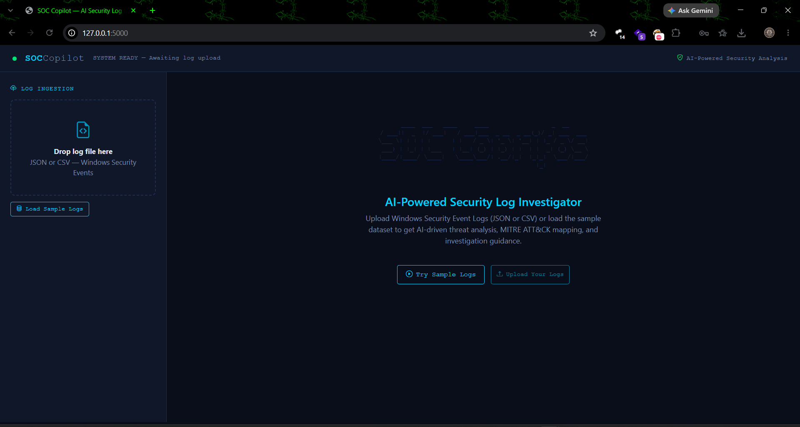
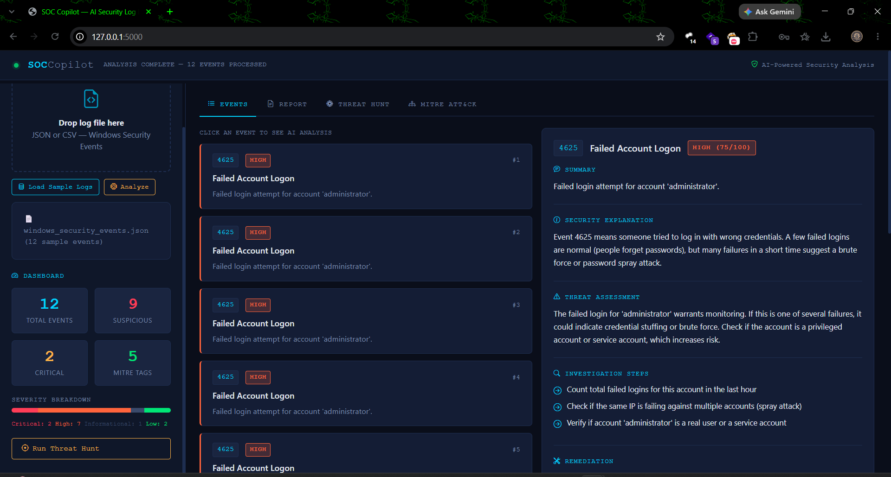
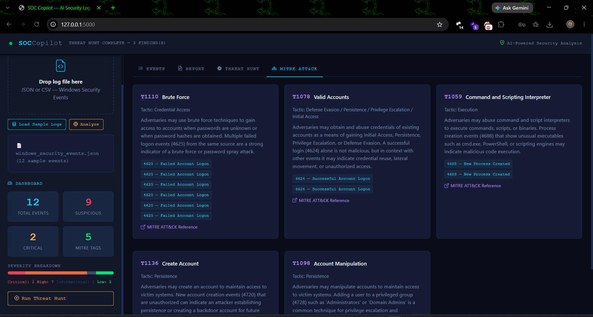

# 🛡️ SOC Copilot — AI-Powered Security Log Investigation Agent

> **🏆 Microsoft Agents League Hackathon Project** | Reasoning Agents Track

SOC Copilot is a cybersecurity-focused reasoning agent that helps Security Operations Center (SOC) analysts investigate Windows Security Event Logs. The application analyzes security events, assesses threat severity, maps activity to MITRE ATT&CK techniques, identifies suspicious behavior, and generates actionable investigation recommendations.

---

## 🎯 Project Overview

Security logs are complex and cryptic. Beginner SOC analysts often spend hours trying to understand what a Windows Event ID means and whether it's a real threat.

**SOC Copilot bridges that gap** by combining:
- **Rule-based severity scoring** — Fast, deterministic analysis of event types
- **AI-Powered Security Reasoning** — Human-readable explanations and multi-step investigation guidance
- **MITRE ATT&CK mapping** — Connect events to the global adversary behavior framework
- **Threat Hunt engine** — Automated pattern detection for brute force, privilege escalation, and more

---

## ✨ Features

| Feature | Description |
|---|---|
| 📤 Log Upload | Upload JSON or CSV Windows Security Event logs |
| 🤖 AI Analysis | AI-powered event analysis with threat assessment and investigation guidance |
| 🎯 Severity Scoring | Automatic 0–100 scoring with Critical/High/Medium/Low/Informational levels |
| 🗺️ MITRE ATT&CK | Maps each event to ATT&CK technique ID, name, tactic, and description |
| 🔍 Threat Hunt | One-click scan for brute force, privilege escalation, and suspicious processes |
| 📊 Dashboard | Live counters for total, suspicious, and critical events |
| 📄 Security Report | Full investigation checklist and remediation recommendations |
| 🖥️ Dark Terminal UI | Professional SOC-themed interface with severity-coded color system |
| 📱 Responsive | Works on desktop and mobile browsers |

### Supported Windows Event IDs
| Event ID | Description | MITRE Technique |
|---|---|---|
| 4624 | Successful Logon | T1078 — Valid Accounts |
| 4625 | Failed Logon | T1110 — Brute Force |
| 4688 | Process Created | T1059 — Command & Scripting Interpreter |
| 4720 | User Account Created | T1136 — Create Account |
| 4728 | Member Added to Privileged Group | T1098 — Account Manipulation |

---

## 🚀 Installation & Running (Windows 11)

### Prerequisites

- Python 3.12 or higher
- Windows 10/11

### Step 1 — Download the Project

Clone or download the repository:

```bash
git clone <repository-url>
cd soc-copilot
```

Or download the ZIP file and extract it to your preferred location.

### Step 2 — Create a Virtual Environment

```bash
python -m venv venv
```

Activate the environment:

```powershell
venv\Scripts\activate
```

### Step 3 — Install Dependencies

```bash
pip install -r requirements.txt
```

### Step 4 — Launch SOC Copilot

#### Option A — Manual Start

```bash
python app.py
```

You should see:

```text
============================================================
  SOC Copilot — AI Security Log Investigation Agent
  Starting server at http://127.0.0.1:5000
============================================================
```

#### Option B — One-Click Start (Windows)

SOC Copilot includes a Windows launcher:

```text
start_soc_copilot.bat
```

Simply double-click the file to:

- Open the project directory
- Activate the virtual environment
- Start the Flask application automatically

### Step 5 — Open the Application

Open your browser and navigate to:

```text
http://127.0.0.1:5000
```

Click **"Try Sample Logs"** to explore a simulated attack scenario and view the complete investigation workflow.

### Optional: AI Integration

SOC Copilot supports AI-powered event analysis and investigation guidance. If an external AI service is configured, the application can provide enhanced security reasoning. Core functionality remains available through the built-in analysis engine.

## 📁 Project Structure

```
soc-copilot/
│
├── app.py                  ← Flask web server, API endpoints
├── analyzer.py             ← AI reasoning engine 
├── mitre_mapping.py        ← MITRE ATT&CK technique lookup table
├── severity_engine.py      ← Severity scoring (0–100) with context analysis
├── report_generator.py     ← Security report and checklist generator
│
├── requirements.txt        ← Python dependencies
├── README.md               ← This file
│
├── templates/
│   └── index.html          ← Web application user interface
│── sample_logs/
│    └── windows_security_events.json  ← Sample Windows Security Event logs
│
└── start_soc_copilot.bat         ← One-click Windows launcher
```

---

## 🧠 How the AI Reasoning Works

SOC Copilot demonstrates **multi-step AI reasoning** by chaining these steps for every event:

```
1. Parse Event
   └─ Extract Event ID, user, timestamp, IP, process name

2. Severity Engine
   └─ Calculate 0–100 risk score based on event type + context
      (e.g., failed login against "administrator" = higher score)

3. MITRE ATT&CK Mapping
   └─ Map Event ID → Technique ID, Name, Tactic, Description

4. AI-Powered Security Analysis
   └─ Generate:
      - Event summary
      - Threat assessment
      - Security explanation
      - Investigation recommendations
      - Remediation guidance

5. Threat Hunt (on demand)
   └─ Pattern analysis across ALL events:
      - Count failed logins per account (brute force)
      - Detect privilege escalation events
      - Flag suspicious process names
```

---

## 🔒 Sample Attack Scenario

The included sample logs (`windows_security_events.json`) simulate a **realistic attack chain**:

1. **Brute Force** — 6 failed logins against the Administrator account
2. **Successful Access** — Attacker authenticates from IP 192.168.1.45
3. **Malicious PowerShell** — Encoded PowerShell command executes a download cradle
4. **Backdoor Account** — New account `svc_backdoor` created
5. **Privilege Escalation** — `svc_backdoor` added to Domain Admins group
6. **Normal Activity** — Legitimate user `jsmith` logging in (baseline)

This mirrors real-world attack patterns mapped to the MITRE ATT&CK framework.

---

## 🖼️ Screenshots


| Screen | Preview | Description |
|---|---|---|
| Welcome Screen |  | Dark terminal-themed landing with ASCII art |
| Event Analysis |  | Per-event AI analysis with severity badges |
| Threat Hunt |  | Automated pattern detection results |
| Report View |  | Investigation checklist and remediation guide |
| MITRE ATT&CK |  | Technique cards with links to official MITRE site |

---

## 🚀 Future Improvements

- [ ] **Live SIEM Integration** — Connect to Splunk, Elastic, or Microsoft Sentinel
- [ ] **Sigma Rule Support** — Parse and apply community detection rules
- [ ] **Timeline View** — Visualize attack progression chronologically
- [ ] **Multi-File Analysis** — Cross-correlate events from multiple log sources
- [ ] **Email Reports** — Export and send PDF investigation reports
- [ ] **Custom Rules Engine** — Let analysts define their own detection logic
- [ ] **User Accounts** — Save and compare historical investigations
- [ ] **Sysmon Support** — Full Sysmon event ID parsing (Event ID 1, 3, 7, etc.)
- [ ] **Network Log Analysis** — Extend to firewall and proxy logs

---

## 🤝 Built For

**Microsoft Agents League Hackathon — Reasoning Agents Track**

SOC Copilot demonstrates reasoning agents by:
- **Multi-step reasoning** over structured security data
- **Context-aware analysis** that adjusts severity based on event relationships
- **Decision support** that guides analysts through investigation steps
- **Human-readable explanations** that bridge AI insights and analyst understanding
- **Actionable outputs** — not just analysis, but specific steps to take next

---

## 📜 License

This project is released under the MIT License.

---

*Built with Python, Flask, and Bootstrap 5.*

*Developed for cybersecurity education and security operations research.*
